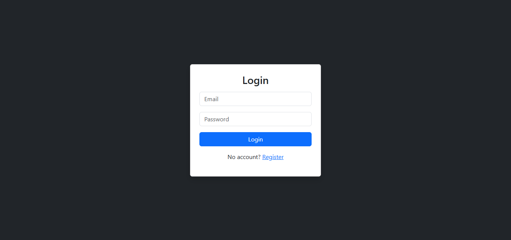
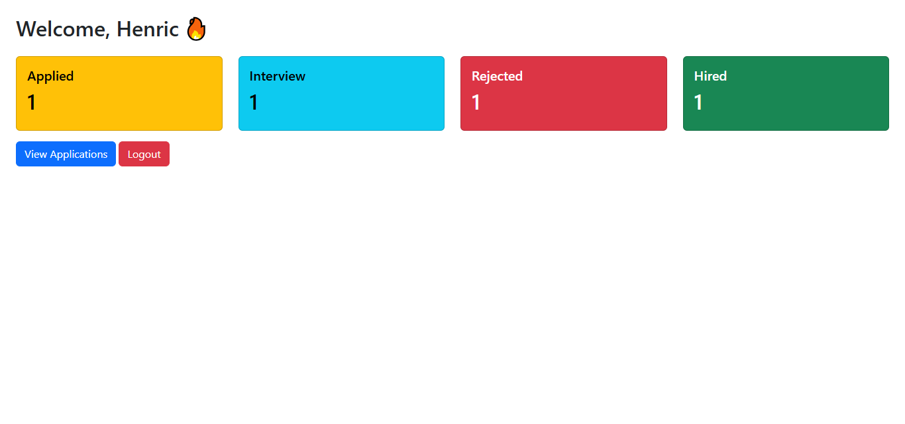
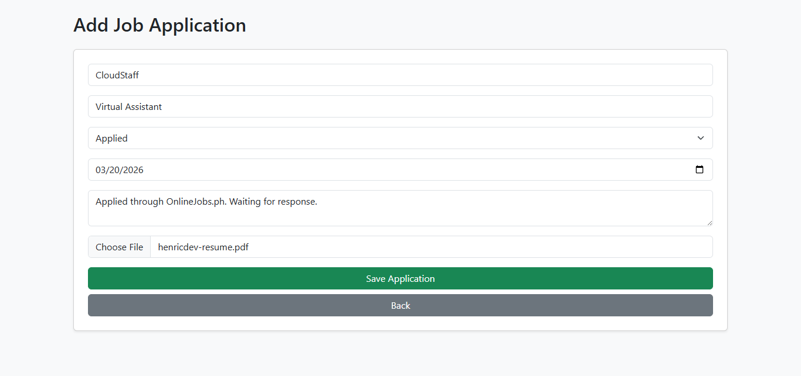
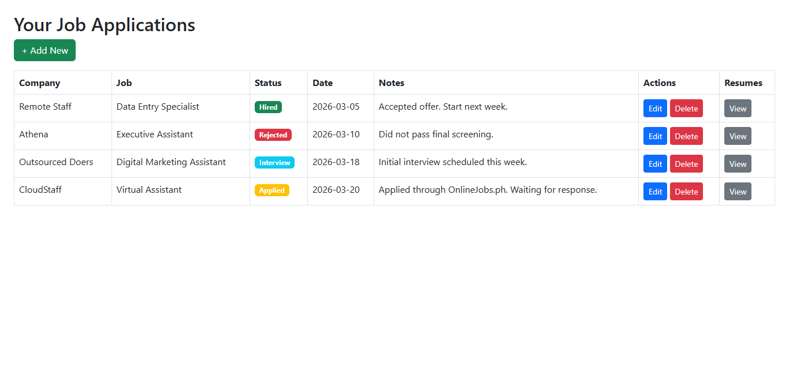

# CareerFlow – Job Application Tracker

CareerFlow is a simple PHP-based system I built to track my job applications in one place. Instead of manually listing applications or forgetting where I applied, this system helps organize everything with status tracking and file uploads.

## Features

* User registration and login
* Add, edit, and delete job applications
* Track application status (Applied, Interview, Rejected, Hired)
* Upload and view resume files
* Dashboard with application statistics
* Clean UI using Bootstrap

## Screenshots

### Login Page

### Dashboard

### Add Application

### Application List

## How to Run

1. Download or clone this repository
2. Move it to your `htdocs` (XAMPP) or `www` (WAMP)
3. Create a database named `careerflow`
4. Import the tables or create them manually
5. Update database connection in `config/db.php`
6. Run in browser:
   http://localhost/careerflow

## Tech Stack

* PHP (Core PHP)
* MySQL
* Bootstrap 5

## Notes

This project was built as part of my personal portfolio to practice backend development concepts like CRUD operations, authentication, and file handling.

More improvements can still be added in the future.
